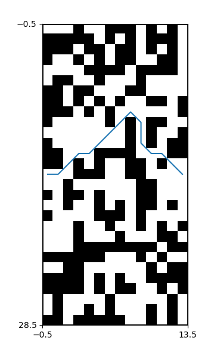
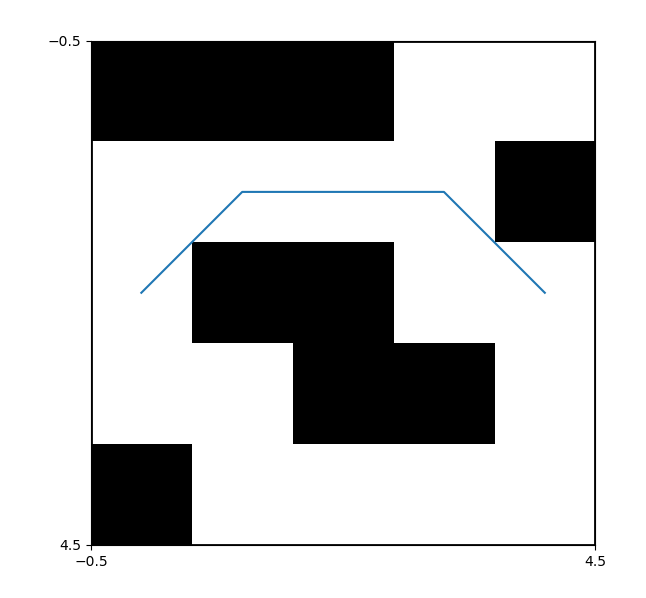

# PathFinding_Astar

## Correct File
The file <b>src.py</b> contains the correct code for finding path using A* Algorithm.  
 

## Screenshots

   
 
 

 

## Input
The Input is a Matrix where 0 defines free space and 1 defines an obstacle.  
By default the start point is the Middle Row,First Column 
and end point is the Middle Row,Last Column 
 
## Output 
The program returns a list of Matrix Points in Successive order to reach the End Point with the Lowest cost.
 
It plots the Maze and the Path using matplotlib

## References 

https://rosettacode.org/wiki/A*_search_algorithm  
 
http://mat.uab.cat/~alseda/MasterOpt/AStar-Algorithm.pdf  
 
https://classroom.udacity.com/courses/cs271  (Part 2 Problem Solving)

## Screenshots

   
 
 
